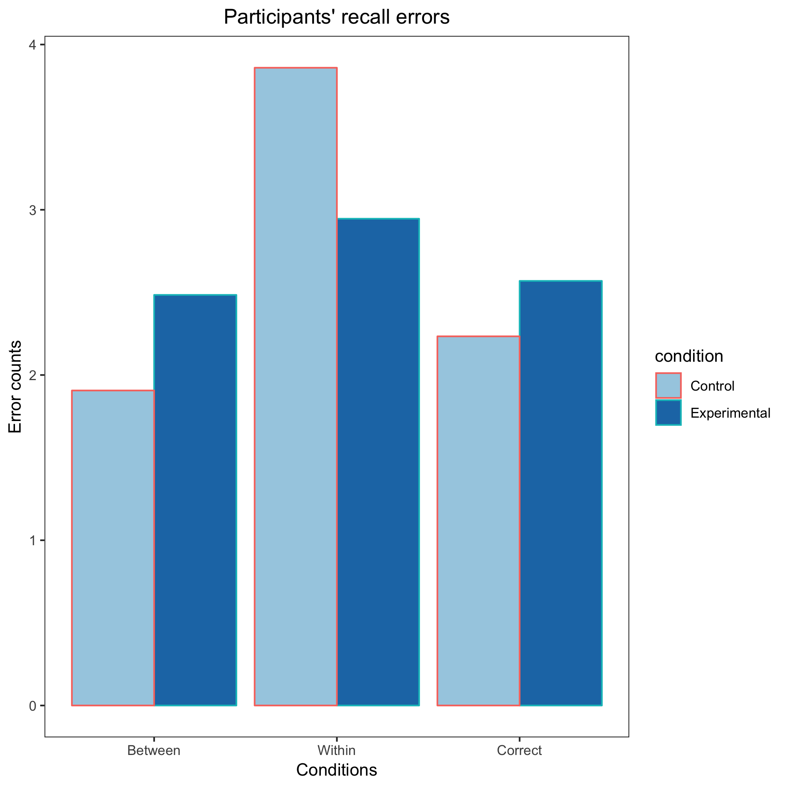

<!-- Replication reports should all use this template to standardize reporting across projects.  These reports will be public supplementary materials that accompany the summary report(s) of the aggregate results. -->

##Introduction
I am interested in how psycho-social factors impact health behaviors in diverse communities. It was difficult finding an article in Psychological Science published between 2016 and 2017 that investigates the topic I am interested in. However, I found a research report with a methodology that I would like to integrate into my own research. The author made the data and materials available via the Harvard Dataverse which should facilitate the replication process. My chosen article is titled *Healthy out-group members are represented psychologically as infected in-group members* (Petersen, 2017). Petersen (2017) investigated the categorical reasoning group members adopt when making inferences about pathogens and infectious diseases. His results demonstrated that out-group members psychologically categorize healthy out-group members similarly to infectious in-group members. My target finding for replication was the unstandardized coeeficient for study 1 that should show an increase in the number of between-group recall error in the experimental condition.

Petersen (2017) used the "who said what?" WSW paradigm to manipulate intergroup reasoning. I found this methodology particularly fascinating and learning the data analysis process to interpret data from such a design will be helpful to my research. To replicate this experiment, I gathered the stimuli (i.e. pictures and statements for the WSW paradigm) from the Harvard Dataverse. Consequently, I used the author's original materials to create the survey on Qualtrics. Unlike the original study, I used MTurk instead of CrowdFlower and YouGov to recruit participants. I replicated study 1 on MTurk. Study 1 included a diverse sample of U.S participants (*N* = 600) while Study 2 has some demographic exclusionary criteria that would hinder a timely data collection completion on MTurk. The data analysis process was challenging due to my lack of experience with data analysis for a such a research design and unfamiliarity with R. Nevertheless, I was excited to gain more experience with the aforementioned design and R as I would have to use them extensively in my upcoming research projects. 


##Methods

###Power Analysis

We use the original effect size: d = .34 to calculate 80%, 90% and 95% power. Here are the results: 80% power: 216 particiapants, 90% power: 298 participants, and 95% power: 376 particpants. Due to our budget restrictions we will be running the sample size for 80% power. 

###Planned Sample
We will run 108 participants in each group which means we will run 216 participants. There are no demographics restrictions for participants except that they must be in the US. We are able to set that on MTurk. 

###Materials
I used the specific materials the author made avaliable on Harvard Dataverse:
*The Who Said What (WSW) paragdigm which included eight pictures (4 in-group i.e White, 4 out-group members i.e East Indian background) and eight neutral statements made by these individuals. 
*A distractor task. 
*A surprise recall task that asked the participants about their recollections of who made which statements. 

Please see the following link to the survey paradigm: https://stanforduniversity.qualtrics.com/jfe/form/SV_3gdaCxLMMHhUj65
More details can be found in the direct quoted paragraphs included in the procedure section below. 

Please find the Github repository for this project here: https://github.com/psych251/petersen2017.git

Here is the link to the OSF preregistration:https://osf.io/apgqj/

###Procedure	
>"The WSW paradigm is organized in three distinct phases. First, participants are presented with a slide show that introduces eight individuals, one at a time. The photo of each individual is presented along with a statement made by the individual, and participants are asked to simply pay attention. Second, participants engage in a distractor task. Third, they are presented with a surprise recall task. One by one, each statement from the presentation phase is presented with the eight photos, and participants are asked to indicate the individual who made the statement (i.e., “who said what?”). 

>Participants were randomly assigned one of two versions of the experiment. In the control condition, all of the pictured individuals were healthy, with no signs of infection. In the treatment condition, although the outgroup members were healthy in appearance, the ingroup members were presented with significant facial rashes, an indication of infection. These rashes were applied to the original photos using Photoshop (see the Supplemental Material available online for additional information, including validation information, on the stimuli)."

The above procedure, quoted directly from the original article, has been followed precisely.

###Analysis Plan

>"By analyzing the errors made in the recall phase, I was able to test whether healthy but physically different out-group members and manifestly infected in-group members were mentally represented using the same psychological category. In the WSW paradigm, if two individuals are confused during the recall phase—that is, if the statement made by one is misattributed to the
other—this suggests that they were identified as alike in the presentation phase and confused in memory (Kurzban et al., 2001; Pietraszewski et al., 2014; Taylor et al., 1978). Previous research has identified a clear tendency for participants to categorize individuals
along group lines in this paradigm (Kurzban et al., 2001; Pietraszewski et al., 2014; Taylor et al., 1978). 

>Similarly, in the present experiment, the participants in the control condition were expected to confuse individuals along group lines. Yet to the extent that healthy out-group members fall in the same mental category as manifestly infected in-group, between-group confusion
would increase in the treatment condition. Note that this is far from a trivial prediction. It implies that by making in-group members visually more similar to each other because of a shared rash, they will become psychologically less distinct relative to the out-group.

>From the answers provided in the recall phase, three measures were created for each participant: the number of correct recalls, the number of within-group recall errors (confusion of a White person with another White person or of an East Indian person with another East Indian person), and the number of between-group recall errors (confusion of an Indian person with a White person). Because each response in the recall phase was necessarily a correct attribution or one of these two types of errors, all three measures could range from 0 to 8. "

**Clarify key analysis of interest here. **
First, I calculated between-group error in recalls for the treatment condition and control condition. I also calculated the linear regression model for the within-group errors as part of my secondary analysis. 

###Differences from Original Study
One key difference lied in the smaller sample size used for the replication. However, we were still adequately powered at 80% (See power analysis above). An additional difference in methodology relates to the recruitment site. The replication was made using MTurk to have access to a "socially diverse" sample of Americans while the original sample used Crowdflower. I also conducted demographic analyses which were not present nor included in the original article.

### Methods Addendum (Post Data Collection)

#### Actual Sample
We ended with a sample of N=224 instead of planned sample of 216. The expiration time on MTurk was set for a short time and the HIT expired before 8 participants could go back to put their completion code. They were paid nonetheless and we still included their data because they finished the study and did so in good faith. 

Our participants were randomly and evenly distributed accross the two conditions. The racial composite of the sampled broke down to 134 Whites, 58 Asians, 19 Black or African Americans, and 14 latinos (Please see racial demographic graph below). In terms of gender breakdown, 143 men and 80 women participated in the study. 

#### Differences from pre-data collection methods plan
"None, but please see above for the reason that led to slightly more participants than planned"

##Results


### Data preparation

Data preparation following the analysis plan.
	
```{r, echo=TRUE, warning=FALSE}
###Data Preparation

####Load Relevant Libraries and Functions
library(readr)
library(dplyr)
library(tidyr)
library(tibble)
library(stringr)
library(ggplot2)

####Import data
Fulldataset <- read_csv("Petersen 2017 Replication Project.csv")
View(Fulldataset)


#then try to figure out the data structure 
structure(Fulldataset)
colnames(Fulldataset)


#### Data exclusion / filtering
Fulldatasetclean<-Fulldataset %>%
  select(-contains ("Date"), -contains ("timer"), -contains ("Duration"), -contains ("Status"),-contains ("Channel"), -contains ("Language"), -contains ("Progress")) #removing columns like timer info, reportid and start date
View (Fulldatasetclean)

# Now, only keeping participants who agreed to participate in the study
Fulldatasetclean<-filter(Fulldatasetclean, `Informed consent`=="Yes") 
View (Fulldatasetclean)

#Now let's see the new demographics.
# To get a frequency or a count of participants' race. 
ggplot(Fulldatasetclean, aes(x=race)) +
  geom_bar()
table(Fulldatasetclean$race) 
table(Fulldatasetclean$gender)
table(Fulldatasetclean$Condition) #Note to self: Make sure to double check that total N for conditions and race and gender all add up to the same total N for the study.

#To get frequency about participants'age
Fulldatasetclean = Fulldatasetclean %>%
  mutate(numeric_age=as.numeric(age))#N.B: Conversion to numeric because this data type is shown as string.

mean(Fulldatasetclean$numeric_age)

#### Prepare data for analysis - create columns etc.
#Tidy the data by gathering it 
Fulldatasetcleanerlong<- Fulldatasetclean %>%
  gather(Recallquestion, Recallresponse, contains("recall"))%>%
  filter(!is.na (Recallresponse))
#create a column with all questions and responses that contain recall in two separate columns. 
View(Fulldatasetcleanerlong)

#between-group recall errors (confusion of an Indian person with a White person and confusion of a White person whith an Indian person). I used the instances where participants were supposed to select an East Asian face as correct, but selected a white one.
##Create a betweengrouperror column
questions_where_target_is_east_asian = c("recall2", "recall4", "recall7", "recall8", "recall10", "recall12", "recall15", "recall16")
questions_where_target_is_white = c("recall1", "recall3", "recall5", "recall6", "recall9", "recall11", "recall13", "recall14")
recall_condensed_data = Fulldatasetcleanerlong %>%
  select(contains("recall"), contains("Recall"), "ResponseId", "Condition", "SC0") %>% # Selecting the columns of interest for the upcoming analyses 
  # make a new "target group" column
  mutate(target_group = ifelse(
    Recallquestion %in% questions_where_target_is_east_asian,
    "EastAsian",
    "White")) %>%
  # record whether correct or incorrect
  mutate(correct = grepl("True", Recallresponse)) %>%
  # make a new "response group" column
  mutate(response_group = ifelse(
    grepl("White", Recallresponse),
    "White",
    "EastAsian"
  )) %>%
  mutate(between_or_within = ifelse(response_group==target_group, "within", "between"))

recall_condensed_data_summary = recall_condensed_data %>% # Making sure within or between group error do not count correct responses as well
  group_by(Condition, ResponseId, between_or_within, SC0) %>%
  summarise(error_count = sum(correct == FALSE))


dataforanalysis=recall_condensed_data_summary %>%
  spread(between_or_within, error_count) %>%
  mutate(between = ifelse(is.na(between), 0, between)) %>%
  mutate(within = ifelse(is.na(within), 0, within)) %>%
  rename(betweenerrorcount = between) %>%
  rename(withinerrorcount = within)%>%
  rename(correctcount=SC0)
View (dataforanalysis)

```
### Confirmatory analysis
The analyses as specified in the analysis plan. 
The confirmatory analysis is a linear regression where the experimental condition should predict an increase in participants' between group errors.
```{r echo=TRUE}
#calculate the linear regression for experimental effect on between-group error

Modelbetween<-lm(betweenerrorcount~Condition, data=dataforanalysis)
#The model is showing me a conditioncondition results row that I need to figure why it's there and which mistakes i made.
summary(Modelbetween)
# To get confidence interval
confint(Modelbetween)

```

*Side-by-side graph with original graph is ideal here*
``` {r}


#The original graph is below
```
```{r echo=TRUE}
#preparing data with sd for error bars

#Getting the ci function from ps5 
sem <- function(x) {sd(x, na.rm=TRUE) / sqrt(sum(!is.na((x))))}
ci <- function(x) {sem(x) * 1.96} # reasonable approximation 

Plotdata<-dataforanalysis %>%
  group_by(Condition)%>%
  summarise(meanbetween =mean (betweenerrorcount), meanwithin= mean(withinerrorcount), sdbetween= sd (betweenerrorcount), sdwithin= sd(withinerrorcount), cibetween= ci(betweenerrorcount), ciwithin= ci(withinerrorcount))
            
View(Plotdata)

ggplot(Plotdata, aes(x=Condition, y=meanbetween, fill=Condition)) +
geom_bar(position="dodge", stat="identity") + 
  geom_errorbar(stat="identity", aes(x=Condition, ymin=meanbetween-cibetween,ymax=meanbetween+cibetween, width =.2))+
labs(title = "Between-group error: confusion of an Asian face with a white one and vice-versa", y = "Between error means", x= "Conditions")+
  scale_x_discrete(labels=c("Control", "Experimental"))+
scale_fill_brewer(palette="Set2",labels= c("Control", "Experimental"))+
    guides(fill=F) + #Hide legends
  theme_bw() +
  theme(panel.grid=element_blank())+
  theme(plot.title = element_text(hjust = 0.5))

#ggsave("betweengraph.png", path =NULL )
```
  
###Exploratory analyses

I will also be doing a secondary analysis of within-group errors to have a more hollistic picture of the study results and implications. 

```{r}
Modelwithin<-lm(withinerrorcount~Condition, data=dataforanalysis)
#The model is showing me a conditioncondition results row that I need to figure why it's there and which mistakes i made.
summary(Modelwithin)
confint(Modelwithin)
#Graphing it
ggplot(Plotdata, aes(x=Condition, y=meanwithin, fill=Condition)) +
geom_bar(position="dodge", stat="identity") + 
   geom_errorbar(stat="identity", aes(x=Condition, ymin=meanwithin-cibetween,ymax=meanwithin+cibetween, width =.2))+
labs(title = "Within-group error: confusion of faces within the same race", y = "Within error means", x= "Conditions")+
  scale_x_discrete(labels=c("Control", "Experimental"))+
scale_fill_brewer(palette="Set2",labels= c("Control", "Experimental"))+
    guides(fill=F) + #Hide legends
  theme_bw() +
  theme(panel.grid=element_blank())+
  theme(plot.title = element_text(hjust = 0.5))

#ggsave("withingraph.png")
```

## Discussion

### Summary of Replication Attempt

Our confirmatory analysis did not replicate. We did not find an increase in between-group errors, b=.37, p=.13, 95% CI=[-0.11, 0.84]. That would suggest that participants did not confuse in-group members with out-group members when the presented in-group members were infected. 

We, however, found a smilarly null finding in the secondary analysis of the within-group errors, b=.24, p=.21, 95% CI=[-0.14, 0.63]. Specifically, the mental process used to categorized infected in-group members is similar to that used to categorized out-group members. 

### Commentary
The failure to replicate the targeted result of between-group errors implies that participants distinctively process infected in-group and healthy out-group members. There were no differences between the design and the analysis of original and the replication to explain the failed replication. I do not think that MTurk and Crowdflower workers are different enough to drive these divergent results. 

This non-replicated finding would suggest that people did not confuse infected in-group members with healthy out-group members. Additionally, this would indicate that one cannot blindly use this finding to support the theory that people's aversion to atypical phenotypes or appearances explains the mental categorization of infected in-group with out-group members.

In addition, participants from the original and the replication are from the US, a country known for the diversity of its population despite its tumultuous racial history. People from different background often care for and interact with each other. This would facilitate some familiarity with people that look different from each other and create some sort of in-group affiliations. Bearing this in mind, the failed replication of a significant increase in between-group errors result would not be surprising.

It is still essential to point out that the authors, replicated their original findings from study 1 in their 2nd study. Nonetheless, I would love to see if they get similar results if they were to replace their stimuli of South East Asians as the out-group with Black or Latinx. Similarly, I would like to see a study with the stimuli where whites are not the in-group but rather the out-group. If their original results replicate in these different contexts, then their conclusion that mental categorization " is rather a result of the more basic perception of deviations from the expected phenotype" would be stronger. 
